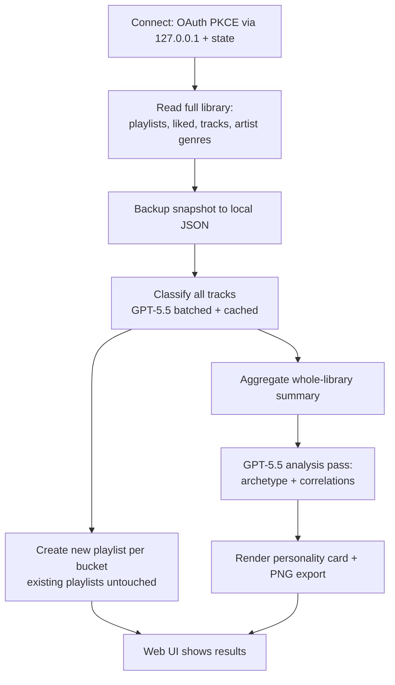
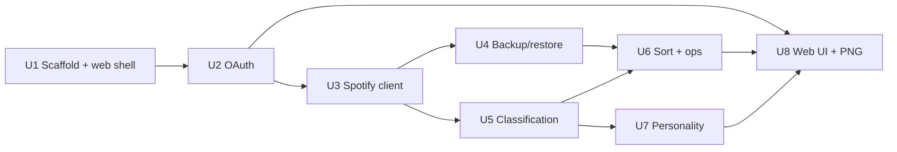

# feat: Spotify Vibe Sorter + Music Personality

## Summary

Build a greenfield TypeScript/Node tool with a single minimalist local web UI: connect Spotify, define vibe buckets, let GPT-5.5 classify the whole library and surface cross-playlist correlations, create real playlists, and download a shareable "music personality" card — with a full backup taken before anything is created, edited, or deleted.

---

## Problem Frame

The owner has too many Spotify playlists with songs they love scattered across them, so the good stuff stays invisible and forgotten. The tool should consolidate the library into clear vibe playlists and produce a shareable personality profile, doubling as a recruiter / Twitter-X portfolio piece. Full situational context, including the Spotify audio-features API deprecation that forces an LLM-based analysis path, lives in the origin requirements doc (see Sources & References).

---

## Requirements

Plan R-IDs trace to the origin requirements doc; revisions made during planning dialogue are noted inline.

**Library & safety**
- R1. Read the entire library — owned playlists, liked songs, track + artist metadata including genre tags and popularity. *(origin R1)*
- R2. Take a full snapshot of every playlist's contents to local storage before any create, edit, or delete. *(origin R2)*
- R3. Provide a restore path that rebuilds playlist contents from a snapshot. *(origin R3)*

**Classification**
- R4. The owner defines their own bucket list; buckets are not a fixed built-in taxonomy. *(origin R4)*
- R5. GPT-5.5 classifies every track into the owner's buckets, with genre tags + metadata supplied as context. *(REVISES origin R5+R6: LLM-primary over the whole library instead of a genre-first pass with LLM only for leftovers.)*
- R6. For subjective buckets, classification is guided by a few owner-tagged example songs and/or by asking the owner. *(origin R7)*

**Playlist operations**
- R7. Sorting only ever creates new playlists — it never modifies or overwrites existing playlists. *(origin R10)*
- R8. Support explicit, owner-triggered edits: rename, reorder, remove tracks. *(origin R11)*
- R9. Support explicit, owner-triggered deletion (unfollow), guarded by an existing backup. *(origin R12)*

**Personality & interface**
- R10. Generate a music-personality profile from a whole-library analysis: archetype label, genre/vibe breakdown, and cross-playlist correlations/insights. *(origin R13, EXTENDED with correlations per planning dialogue.)*
- R11. Render the profile as a shareable card with a download-as-PNG export, inside the web UI. *(origin R14)*
- R12. A single minimalist local web UI is the entire interface — connect, buckets, sort, results, card. *(REPLACES the CLI shape from origin/early dialogue per planning revision.)*
- R13. Codebase, README, and a runnable demo read as recruiter-grade. *(origin R15)*

**Origin actors:** A1 (owner/you), A2 (Spotify Web API), A3 (LLM API — OpenAI GPT-5.5), A4 (ReccoBeats — deferred)
**Origin flows:** F1 (sort library into vibe playlists), F2 (generate + share personality card), F3 (backup/restore), F4 (edit/delete safely)
**Origin acceptance examples:** AE1 (no genre tags → still classified), AE2 (subjective bucket uses examples/asks), AE3 (delete triggers backup-first), AE4 (new playlist created even on name collision)

---

## Scope Boundaries

### Deferred for later

*(Carried from origin — product/version sequencing.)*
- Hosted, multi-user web app where strangers connect their own Spotify (requires Spotify extended-quota app review).
- ReccoBeats energy/BPM sub-splitting within a bucket (origin R8 / A4).

### Outside this product's identity

*(Carried from origin — positioning rejection.)*
- A recommendation / discovery engine for *new* music. This organizes and resurfaces what the owner already has.
- A mobile app or always-on / real-time background syncing.
- Editing other people's playlists (Spotify returns those as metadata-only).
- Any workaround to revive the deprecated audio-features endpoint.

### Deferred to Follow-Up Work

*(Plan-local — implementation intentionally postponed.)*
- Genre-map-first cost-saver classification pass: add only if GPT-5.5 cost becomes annoying. The LLM-primary path (R5) ships first.
- Preview-then-confirm UI before writes: safety is already covered by mandatory backup + new-playlists-only sorting.
- Backup retention/pruning policy beyond keeping recent snapshots.

---

## Context & Research

### Relevant Code and Patterns

Greenfield repo — no existing code or patterns to follow. The directory contains only the origin requirements doc. All units below are net-new.

### Institutional Learnings

None — no `docs/solutions/` in this repo.

### External References

From the brainstorm research pass (see origin doc Problem Frame and Sources):
- Spotify deprecated `audio-features`, `audio-analysis`, `recommendations`, `related-artists`, and bulk multi-get for new apps (Nov 2024; tightened Feb 2026 — Premium required, 5-user dev cap). Still available: read playlists/liked/tracks, artist `genres`, create/edit/delete playlists.
- Viable analysis path for a new app = artist genre tags + LLM classification (handles subjective vibes), optionally ReccoBeats for energy/BPM.
- Community rate-limit consensus ~180 req/min; no bulk multi-get means per-track/per-artist fetches dominate — dedupe unique artists to cut genre lookups.

---

## Key Technical Decisions

- **Spotify access via the official `@spotify/web-api-ts-sdk`**: typed, modern, maintained by Spotify — a cleaner portfolio signal than the older community libs. Fall back to a community lib only if the SDK lacks a needed endpoint.
- **OAuth = Authorization Code + PKCE with a transient loopback redirect**: standard for a local public client (no client secret to leak); the web app's "Connect" button drives it. The redirect URI uses the loopback IP form `http://127.0.0.1:<port>/callback` (Spotify rejects plain `localhost` for non-HTTPS redirects since the late-2025 tightening) and must byte-match the registered URI. A cryptographically random `state` value is generated and validated on the callback to close the loopback CSRF vector PKCE alone does not cover. The PKCE `code_verifier` persists server-side (in-memory session keyed by `state`) across the redirect round-trip. Tokens + refresh persisted to a gitignored local data dir and auto-refreshed.
- **All state in local JSON files** (tokens, backups, classification + analysis cache, bucket config): no database — YAGNI for a single-user local tool, and it keeps setup frictionless. The token file is written with `0600` permissions so it is not world-readable on a shared machine, and the local server binds to `127.0.0.1` (not `0.0.0.0`) with a same-origin check so the JSON API is not reachable from the network or cross-origin tabs.
- **LLM-primary, batched, cached classification** *(revises origin's two-pass)*: GPT-5.5 classifies all tracks with genre tags + metadata as context. One mechanism instead of two = simpler code and lets the model see everything. Caching bounds *repeat* cost (re-runs are free), but the *first* run on a large library is a real cost/latency/rate-limit event — the plan must surface a measured estimate after a first real run (target: a few thousand tracks) and treat the deferred genre-map cost-saver as **mandatory, not optional, above a stated threshold** (e.g., libraries beyond ~Nk tracks or first-run cost beyond a chosen dollar ceiling). See Risks and Open Questions.
- **Personality via aggregate-then-analyze**: the whole library is summarized and that compact aggregate is sent to a final GPT-5.5 pass for archetype + correlations. To actually support *cross-playlist* correlations (e.g., "sad songs cluster in workout playlists"), the aggregate must carry a bounded **per-playlist × per-bucket co-occurrence structure**, not just scalar global distributions — otherwise the model invents plausible-but-ungrounded correlations. Tracks in the "unsorted" fallback are excluded from the archetype computation. Raw thousands of tracks are never dumped into one prompt.
- **Single minimalist local web UI is the whole interface** *(replaces the CLI)*: better serves the visual/shareable goal and the owner's stated preference for simple/minimalist. The local server already exists for the OAuth redirect, so a small JSON API + one page is a natural, low-surface choice.
- **LLM behind a thin provider module**: a single `llm.ts` boundary with the GPT-5.5 implementation. The file boundary is the swap point the owner asked for; a formal multi-provider interface is deferred until a second provider actually exists (avoids speculative abstraction at v1).
- **Safety model**: a full backup is **load-bearing for the explicit edit/delete operations and for sort's re-run "replace" path** (which deletes the tool's prior playlists). A first-run create-only sort touches nothing existing, so its snapshot is cheap insurance rather than essential protection. Restore recreates *track contents* into a new playlist — it does **not** resurrect a deleted playlist's identity (ID, followers, links); the safety guarantee is "no track is unrecoverable," not "delete is fully reversible."
- **Generated-playlist identity is durable, not local-state-only**: the tool stamps each playlist it creates with a recognizable marker (a tag in the playlist description) so a re-run can re-identify its own output by reading **live Spotify**, not just gitignorable `.data/` state. Re-runs reconcile against the live account: a generated playlist the owner renamed is still recognized by its marker; one the owner deleted is simply recreated. The "replace" step routes through the backup-guarded delete path — it is an explicit mutation, not part of the create-only invariant.
- **Data-to-OpenAI boundary is explicit**: track name, artist, genres, popularity, and the library aggregate are sent to OpenAI; full PII is not. This boundary, and the option to enable OpenAI zero-data-retention, is documented in the README so a cloner of this portfolio repo understands what leaves the machine.

---

## Open Questions

### Resolved During Planning

- Stack: TypeScript/Node, single language for engine + web UI.
- Spotify lib: official `@spotify/web-api-ts-sdk`.
- Storage: local JSON files, no DB.
- Auth: Authorization Code + PKCE with a `127.0.0.1` loopback redirect, `state` CSRF guard, and the verifier persisted server-side keyed by `state`.
- Classification: LLM-primary, batched, cached (genre-first cost-saver deferred but mandatory above a cost/size threshold).
- Interface: one minimalist local web UI (no CLI).
- Personality: aggregate-then-analyze with a per-playlist × per-bucket co-occurrence matrix for grounded correlations.
- Re-run identity: generated playlists are marked in their description and re-identified from live Spotify, not local state.

### Deferred to Implementation

- [Needs research] Confirm the artist `genres` field still returns usable data for a newly registered app in 2026 — verify while building U3; the LLM path degrades gracefully (classifies from name + artist) if genres are thin.
- [Decision] The concrete threshold (library size and/or first-run dollar ceiling) at which the deferred genre-map cost-saver becomes mandatory — set after a real first-run cost measurement during U5.
- PNG export approach for the card (client-side html-to-image vs server-side render) — decide while building U8.
- LLM batch size and backoff constants vs 429s and cost — tune while building U5.
- Exact bucket-config schema and how tagged examples are referenced — settle while building U5.
- Pagination page size and 429 backoff constants for the Spotify client — settle while building U3.
- Local server port (fixed vs configurable; a random high port is less guessable than a well-known one) — settle while building U1.

---

## Output Structure

    spotify-sort/
      package.json
      tsconfig.json
      .gitignore
      .env.example                  # SPOTIFY_CLIENT_ID, OPENAI_API_KEY, redirect URI
      README.md
      src/
        server/
          index.ts                  # local HTTP server: serves UI + JSON API + OAuth callback
        web/
          index.html                # single minimalist page
          app.ts                     # UI logic: connect, buckets, sort, results
          card.ts                    # personality card render + PNG export
        auth/
          oauth.ts                   # PKCE auth-code flow
          tokenStore.ts              # persist/refresh tokens
        spotify/
          client.ts                  # SDK wrapper, pagination, 429 backoff
          library.ts                 # read playlists/liked/tracks/artists
          playlists.ts               # create/add/remove/reorder/unfollow
        backup/
          snapshot.ts                # export library state
          restore.ts                 # rebuild from snapshot
        classify/
          engine.ts                  # orchestrates batched classification
          llm.ts                     # swappable provider interface (GPT-5.5 impl)
          buckets.ts                 # bucket config + examples
          cache.ts                   # per-track classification cache
        operations/
          sort.ts                    # backup -> classify -> create new playlists
          edit.ts                    # explicit edit/delete, backup-guarded
        profile/
          aggregate.ts               # whole-library summary
          analyze.ts                 # LLM personality + correlations pass
        config/
          paths.ts                   # data dir + file locations
      .data/                         # gitignored: tokens, backups, caches, bucket config
      tests/

This tree is a scope declaration, not a constraint — the implementer may adjust layout if it reveals a better shape. Per-unit `Files` lists are authoritative.

---

## High-Level Technical Design

> *This illustrates the intended approach and is directional guidance for review, not implementation specification. The implementing agent should treat it as context, not code to reproduce.*

Runtime sort + profile pipeline:

Implementation-unit dependency graph:

---

## Implementation Units

### U1. Project scaffolding + local web app shell

**Goal:** Stand up the TypeScript/Node project, a local HTTP server that serves a single page and a JSON API, config/paths, env handling, gitignore, and a README skeleton.

**Requirements:** R12, R13

**Dependencies:** None

**Files:**
- Create: `package.json`, `tsconfig.json`, `.gitignore`, `.env.example`, `README.md`
- Create: `src/server/index.ts`, `src/web/index.html`, `src/web/app.ts`, `src/config/paths.ts`
- Test: `tests/server.test.ts`

**Approach:**
- Local HTTP server **binds to `127.0.0.1`** (not `0.0.0.0`) so the JSON API — which can delete playlists and trigger backups — is not reachable from the network. A same-origin check rejects requests whose `Origin` is neither absent (same-origin fetch) nor the known local origin.
- `.data/` directory for all runtime state, gitignored; secrets from env (`SPOTIFY_CLIENT_ID`, `OPENAI_API_KEY`, redirect URI). `.gitignore` covers `.data/` and `.env*` (except `.env.example`).
- README skeleton with setup placeholders (filled in U2/U8).

**Patterns to follow:** Greenfield — establish the conventions (module boundaries per Output Structure) the rest of the plan follows.

**Test scenarios:**
- Happy path: server boots on `127.0.0.1` and responds 200 with the single page at the root route.
- Happy path: an unknown API route returns a structured 404 JSON error.
- Error path: an API request with a foreign `Origin` header is rejected.
- Test expectation: remaining scaffolding (tsconfig, gitignore, env example) is non-behavioral — no tests.

**Verification:** `npm run dev` (or equivalent) starts the server and the page loads in a browser.

---

### U2. Spotify OAuth (PKCE + loopback redirect + token store)

**Goal:** Implement the Connect flow — Authorization Code + PKCE, a `127.0.0.1` loopback callback route with `state` validation, token exchange, persistence, and auto-refresh.

**Requirements:** R1 (precondition), R12

**Dependencies:** U1

**Files:**
- Create: `src/auth/oauth.ts`, `src/auth/tokenStore.ts`
- Modify: `src/server/index.ts` (callback route), `src/web/app.ts` (Connect button)
- Test: `tests/auth.test.ts`

**Approach:**
- Public-client PKCE: generate `code_verifier` + `code_challenge` and a random `state`; persist the verifier server-side keyed by `state`; open Spotify consent; capture the code on the `http://127.0.0.1:<port>/callback` route; **reject the callback if `state` does not match**; exchange code + verifier for tokens.
- The redirect URI is the loopback IP form (`127.0.0.1`, not `localhost`) and must byte-match the URI registered in the Spotify dashboard, including port and path.
- The SDK's built-in `AuthorizationCodeWithPKCEStrategy` is browser/SPA-oriented (drives `window.location`, stores the verifier in browser storage). Since the code is captured on a Node callback, do the PKCE exchange manually and construct the SDK client from the obtained tokens via a custom auth/token provider — decide this token-injection seam in this unit so U3's "all calls go through the wrapper" assumption holds.
- Persist access + refresh + expiry to `.data/` JSON written with `0600` permissions; refresh automatically when expired so subsequent runs reuse the session.
- Request only the scopes needed for library read + playlist modify.

**Patterns to follow:** A standard server-side PKCE exchange; the SDK is constructed from already-obtained tokens rather than driven by its browser auth strategy.

**Test scenarios:**
- Happy path: a valid auth code with matching `state` exchanges for tokens and persists them.
- Error path: a callback whose `state` does not match the persisted value is rejected (CSRF guard).
- Edge case: the token file is created with `0600` permissions (not world-readable).
- Edge case: an expired access token triggers a refresh before an API call.
- Edge case: missing/corrupt token store prompts re-auth rather than crashing.
- Error path: a failed token exchange surfaces a clear, actionable error.
- Happy path: persisted tokens round-trip (write then read) intact.

**Verification:** Connecting once lets later commands run without re-consenting until the refresh token is revoked.

---

### U3. Spotify API client (read library + write ops + pagination + rate-limit)

**Goal:** A typed wrapper over the SDK that reads the full library and performs all playlist writes, handling pagination, 429 backoff, and track/artist dedupe.

**Requirements:** R1, R7, R8, R9

**Dependencies:** U2

**Files:**
- Create: `src/spotify/client.ts`, `src/spotify/library.ts`, `src/spotify/playlists.ts`
- Test: `tests/spotify.test.ts`

**Approach:**
- Read: assemble paginated playlists, liked songs, and track metadata into full lists; fetch artist `genres` per *unique* artist (far fewer than tracks) and cache them.
- Write: create playlist, add/remove/reorder tracks, unfollow.
- Resilience: exponential backoff on 429; single-item fetches where bulk multi-get was removed (Feb 2026).
- Early in this unit, verify the artist `genres` field still returns data (deferred research item).

**Patterns to follow:** Establish a single client wrapper that every other module calls — no direct SDK use elsewhere.

**Test scenarios:**
- Happy path: reading a multi-page playlist assembles all items into one list (mock paginated responses).
- Happy path: unique-artist dedupe issues one genre fetch per artist, not per track.
- Edge case: an empty playlist / empty liked-songs set returns an empty list cleanly.
- Error path: a 429 triggers backoff and a retry that then succeeds.
- Error path: a persistent 5xx surfaces a clear error after retries.
- Happy path: create playlist returns an id; add/remove/reorder/unfollow call the expected operations.

**Verification:** Against fixtures, a full read returns the expected track/artist counts and writes invoke the correct endpoints.

---

### U4. Backup & restore

**Goal:** Snapshot every playlist's contents to local JSON before any mutation, and restore membership from a chosen snapshot.

**Requirements:** R2, R3

**Dependencies:** U3

**Files:**
- Create: `src/backup/snapshot.ts`, `src/backup/restore.ts`
- Test: `tests/backup.test.ts`

**Approach:**
- Snapshot serializes all playlists (id, name, ordered track ids) plus liked songs to a timestamped file in `.data/backups/`.
- Restore rebuilds playlist *membership* from a selected snapshot. Note the limit: restoring an unfollowed/deleted playlist recreates its tracks in a **new** playlist with a new ID — the original playlist's identity (ID, followers, external links) is not recoverable. The guarantee is track recoverability, not full playlist-identity reversal; surface this honestly in the UI/README rather than promising "undo delete."
- A destructive operation requests a fresh snapshot first if no current backup exists; if the snapshot write fails, the mutation is aborted.

**Execution note:** Implement snapshot + the "no-backup → take one" guard test-first — this guard is the safety contract the destructive ops in U6 depend on.

**Test scenarios:**
- Covers AE3. Error/guard path: triggering a delete with no current backup takes a backup before the delete proceeds.
- Happy path: a snapshot captures every playlist and its track order.
- Happy path: restore rebuilds membership to match a snapshot.
- Edge case: restore run twice is idempotent (no duplicate tracks).
- Error path: a snapshot write failure aborts the pending mutation (no partial mutate).

**Verification:** A snapshot file exists and round-trips; destructive ops refuse to run unless a successful backup is present.

---

### U5. Classification engine (LLM-primary, batched, cached) + bucket config

**Goal:** Classify every track into the owner's buckets via GPT-5.5 in batches, using genre + metadata as context, with caching and example-guided fuzzy buckets.

**Requirements:** R4, R5, R6

**Dependencies:** U3, U1

**Files:**
- Create: `src/classify/engine.ts`, `src/classify/llm.ts`, `src/classify/buckets.ts`, `src/classify/cache.ts`
- Test: `tests/classify.test.ts`

**Approach:**
- Bucket config (names + optional example track ids) lives in local JSON, owner-editable from the UI.
- Batch N tracks per LLM call with `{name, artist, genres, popularity}` plus bucket definitions and any examples; the model returns one bucket per track.
- Validate/coerce the model's answer to a known bucket; unrecognized answers fall back to an "unsorted" bucket.
- Cache classification by track id so re-runs skip the LLM; calls go through a thin `llm.ts` provider module (GPT-5.5 impl).
- **Sanitize LLM errors at the `llm.ts` boundary**: catch SDK exceptions and re-throw a stripped error (no headers, request config, or auth fields) so the OpenAI key cannot leak into server logs or the UI.
- **Track classification completeness**: the engine records how many of the library's tracks are classified vs failed/pending, so the sort orchestrator (U6) can refuse to build playlists from a partial run (see U6).
- Re-classification is per-track-cached, so a stable library re-runs identically; note that *editing a bucket definition* invalidates the cache and can legitimately reshuffle tracks — this is expected, not a bug.

**Patterns to follow:** Mirror the client-wrapper discipline from U3 — all model calls go through `llm.ts`.

**Test scenarios:**
- Covers AE1. Edge case: a track whose artist has no genre tags is still assigned a bucket (the model handles it from name + artist).
- Covers AE2. Happy path: a subjective bucket includes the owner's tagged examples in the prompt context.
- Happy path: every track is mapped to exactly one known bucket.
- Edge case: a model response naming an unknown bucket is coerced to the fallback.
- Happy path: a previously classified track is served from cache with no LLM call on re-run.
- Edge case: a partial final batch (fewer than N tracks) classifies correctly.
- Error path: an LLM call failure retries/backs off and preserves already-cached progress.
- Error path: a caught LLM error does not contain the value of `OPENAI_API_KEY`.
- Happy path: after a run with some failed tracks, the engine reports an incomplete-classification status.

**Verification:** Classifying a fixture library yields one valid bucket per track; a second run makes zero LLM calls; a forced LLM error surfaces a sanitized message.

---

### U6. Sort + playlist operations (create/sort + edit/delete, backup-guarded)

**Goal:** Orchestrate Sort (backup → classify → create one new playlist per bucket, never touching existing playlists) and expose explicit edit/delete operations.

**Requirements:** R7, R8, R9

**Dependencies:** U3, U4, U5

**Files:**
- Create: `src/operations/sort.ts`, `src/operations/edit.ts`
- Test: `tests/operations.test.ts`

**Approach:**
- Sort: classification must be **complete** (U5 status) before any playlist is created — a partial run is reported to the user and creates nothing, so the owner never gets silently-incomplete vibe playlists.
- Create a new playlist per non-empty bucket → add its tracks → **stamp each created playlist with a recognizable marker in its description**. A bucket whose name collides with an existing playlist still creates a *new* playlist; the existing one is never touched.
- **Re-run identification reads live Spotify, not just `.data/`**: the tool finds its prior output by the description marker on the live account, so a generated playlist the owner renamed is still recognized and one they deleted is simply recreated — `.data/` is a cache, not the source of truth.
- **"Replace" is an explicit mutation, not part of create-only**: a re-run that supersedes prior output unfollows the old marked playlists through the U4 backup-guarded delete path, then creates fresh ones.
- Edit (rename/reorder/remove) and delete (unfollow) route through the backup guard from U4.

**Test scenarios:**
- Covers AE4. Happy path: a bucket named like an existing playlist produces a new playlist; the existing one is unchanged.
- Happy path: each non-empty bucket becomes one new playlist containing its classified tracks, stamped with the marker.
- Error path: sort with an incomplete classification creates no playlists and reports the gap.
- Happy path: a re-run identifies prior output by marker even when its `.data/` state was wiped.
- Edge case: a generated playlist the owner renamed in Spotify is still recognized on re-run (matched by marker, not name).
- Edge case: an empty bucket creates no playlist.
- Edge case: re-running sort does not duplicate the tool's previously generated playlists.
- Error path: a delete (including re-run "replace") attempted with no backup is blocked (ties to U4 guard).

**Verification:** After a sort, new marked vibe playlists exist with classified tracks, all pre-existing playlists are unchanged, a backup is present, and a re-run reconciles against the live account rather than duplicating.

---

### U7. Personality + correlations analysis

**Goal:** Build a whole-library aggregate and run a GPT-5.5 analysis pass that returns an archetype, a genre/vibe breakdown, and cross-playlist correlations.

**Requirements:** R10

**Dependencies:** U5

**Files:**
- Create: `src/profile/aggregate.ts`, `src/profile/analyze.ts`
- Test: `tests/profile.test.ts`

**Approach:**
- Aggregate computes genre/bucket distribution, top artists, popularity/era spread, **and a bounded per-playlist × per-bucket co-occurrence matrix** (which buckets concentrate in which playlists) — this matrix, not a scalar "overlap" stat, is what lets the model ground cross-playlist correlations like "your sad songs cluster in workout playlists." Without it the model would fabricate plausible-but-ungrounded insights.
- Keep the matrix bounded (top playlists × defined buckets) so the prompt stays compact; raw tracks are never sent.
- "unsorted"-fallback tracks are excluded from the archetype/breakdown so failed classifications don't skew the personality.
- The aggregate is sent to GPT-5.5 for a named archetype, a short narrative, and a few correlation insights drawn from the matrix.
- Cache the analysis result; recompute when the library or buckets change materially.

**Test scenarios:**
- Happy path: breakdown percentages sum to ~100% and exclude unsorted tracks.
- Happy path: the pass returns an archetype plus at least one correlation insight grounded in the co-occurrence matrix.
- Integration: a planted cross-playlist pattern in a fixture (one bucket concentrated in specific playlists) appears in the matrix and the surfaced correlations.
- Edge case: an empty or tiny library produces a graceful result, not an error.
- Edge case: the aggregate (including the matrix) stays within a bounded size — raw thousands of tracks are never sent in one prompt.
- Error path: an LLM failure retries and surfaces a partial/clear result.

**Verification:** For a fixture library, the profile object contains an archetype, a breakdown, and at least one correlation insight.

---

### U8. Minimalist web UI + PNG export

**Goal:** A single simple local page tying it together — connect, define buckets/examples, run Sort with progress, view the personality + correlations, and download the share card as PNG.

**Requirements:** R10, R11, R12

**Dependencies:** U2, U6, U7

**Files:**
- Modify: `src/web/index.html`, `src/web/app.ts`, `src/server/index.ts` (JSON API routes)
- Create: `src/web/card.ts`
- Test: `tests/web.test.ts`

**Approach:**
- One minimalist page; JSON API endpoints wrap the engine (connect, buckets, sort, profile).
- Progress shown via simple polling of the sort job state.
- The personality card renders the profile as HTML and exports to PNG (client-side html-to-image vs server-side render decided here). Nothing fancy — clean and minimal.

**Test scenarios:**
- Integration: a connect → sort → profile run drives the engine end-to-end with externals mocked.
- Happy path: the card renders the profile fields (archetype, breakdown, an insight).
- Happy path: PNG export produces a non-empty image.
- Edge case: the UI reflects a sort-in-progress state and then completion.
- Error path: an API/engine error is shown in the UI rather than failing silently.

**Verification:** From a fresh state, the page walks connect → sort → profile and offers a downloadable card.

---

## System-Wide Impact

- **Interaction graph:** Web UI → JSON API (`src/server`) → engine modules (`auth`, `spotify`, `backup`, `classify`, `operations`, `profile`). A single funnel; the UI holds no business logic.
- **Error propagation:** API and LLM failures must not corrupt local state — back up before mutating, write JSON atomically, and keep classification progress cached so a failed run resumes instead of restarting.
- **State lifecycle risks:** token refresh; classification cache invalidation when bucket config changes; backups accumulate (keep recent N — pruning deferred); the tool re-identifies its own generated playlists by the live-Spotify description marker (not just `.data/` state) so a wiped cache or a manual rename does not cause duplication.
- **API surface parity:** every action is available through the engine modules; the UI is a thin layer over them so there is no duplicated logic to drift.
- **Unchanged invariants:** the owner's *non-tool* playlists are never modified by sort — only new playlists are created. The exception is the tool's own prior output, which a re-run's "replace" supersedes via the backup-guarded delete path. Edit/delete touch existing playlists only when explicitly triggered and only after a backup.

---

## Risks & Dependencies

| Risk | Mitigation |
|------|------------|
| Artist `genres` field deprecated/thin for new apps | Verify early in U3; LLM classifies from name + artist regardless, so the path degrades but still works. |
| GPT-5.5 **first-run** cost/latency on a large library is unmeasured | Genre-map cost-saver becomes mandatory above a stated threshold (Open Questions); record a real first-run cost/latency estimate; cache makes repeat runs free. Caching alone does NOT bound the first run. |
| Rate limits / no bulk multi-get (Feb 2026) | Dedupe unique artists, cache genres, exponential backoff on 429; account for combined Spotify + OpenAI rate surfaces in wall-clock. |
| Partial classification → silently incomplete playlists | Sort gates on complete classification (U5 status); a partial run creates nothing and reports the gap. |
| Re-run duplication if `.data/` state lost or playlist renamed | Re-identify own output by live-Spotify description marker, not local state. |
| "Delete is reversible" overclaim | Restore recovers track contents only; a deleted playlist returns as a new ID. Surfaced honestly in UI/README, not promised as full undo. |
| OAuth CSRF on the loopback callback | Random `state` generated and validated on the callback (PKCE alone does not cover this). |
| Token/secret exposure | Token file `0600`; server bound to `127.0.0.1` + origin check; LLM errors sanitized of the API key; `.env*` (except example) gitignored. |
| Spotify dev-mode limits (Premium required, 5-user cap) | Fine for single-user v1; documented in README setup. |
| LLM nondeterminism in bucket assignment | Validate/coerce to a known bucket; per-track cache keeps a stable library stable (a bucket-definition edit legitimately reshuffles). |

**Dependencies / prerequisites:** Spotify Premium account + a registered dev app with a `127.0.0.1` loopback redirect URI; an OpenAI API key for GPT-5.5; Node toolchain.

---

## Documentation / Operational Notes

- README: how to create the Spotify app (Premium), set the `http://127.0.0.1:<port>/callback` redirect URI, set env vars (`SPOTIFY_CLIENT_ID`, `OPENAI_API_KEY`), run the app, plus screenshots/GIF of the personality card for the portfolio angle.
- **Data & Privacy section** (README): exactly what is sent to OpenAI (track name, artist, genres, popularity, and the library aggregate — not full PII), what stays local, and how to enable OpenAI zero-data-retention for users who prefer it.
- `.env.example` committed; real secrets live in `.env` (or `.env.local`), and `.env*`-except-example plus `.data/` are gitignored.
- Note Spotify dev-mode constraints (single-user, Premium) so future readers understand why it isn't publicly hosted, and that restore recovers tracks but not deleted-playlist identity.

---

## Sources & References

- **Origin document:** [docs/brainstorms/spotify-vibe-sorter-requirements.md](docs/brainstorms/spotify-vibe-sorter-requirements.md)
- External: Spotify Web API changes (Nov 2024 + Feb 2026), official `@spotify/web-api-ts-sdk`, OpenAI API — captured in the origin doc's research and Dependencies sections.
